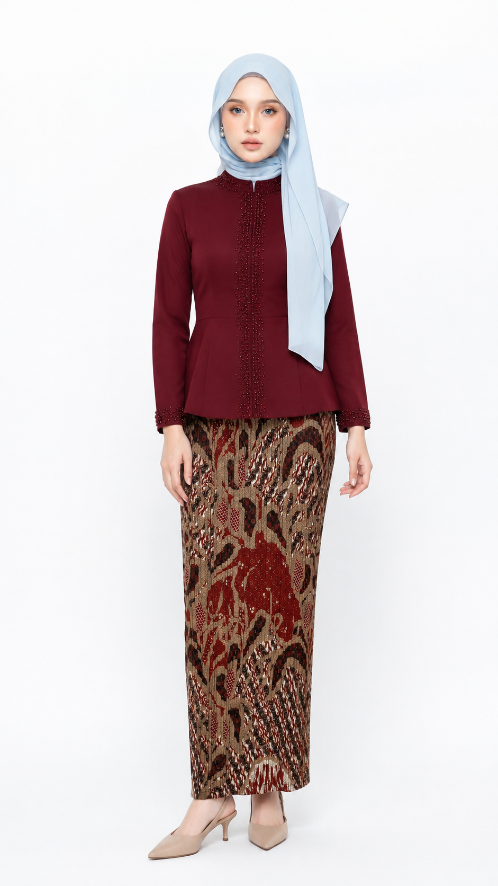
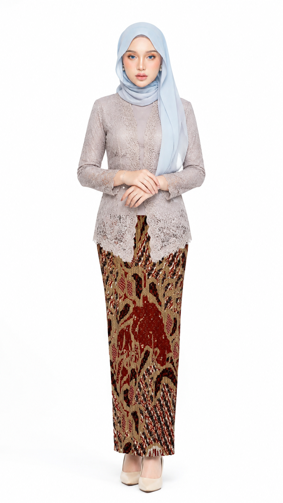

# Douyin Mirror Outfit Storyboard

一套面向现代马来西亚女性穿搭的 Codex Skill：从服装商品图与成年模特参考图生成镜前自拍模特图、连续分镜，以及 Seedance 2.0 / OmniFlash 视频提示词。

An installable Codex skill for Malaysian women’s fashion mirror-selfie imagery, storyboards, and Seedance 2.0 / OmniFlash video prompts.

## 功能 / Features

- 严格锁定上传商品的颜色、版型、图案、长度、剪裁与可见设计细节。
- 严格锁定成年模特身份；分镜中保持同一人物、同一商品与同一搭配。
- 自动补齐现代马来西亚女性穿搭；默认不添加包包。
- 识别 Hijab、Tudung 或端庄造型后启用端庄搭配约束。
- 输出 9:16 镜前自拍图、10 镜头分镜、10 秒动作表、Seedance 2.0 中文提示词和 OmniFlash 英文提示词。
- Strict product and adult-model identity locking across images and shots.
- Malaysian styling with conditional modest/Hijab handling and no bag by default.

## 仓库内容 / Repository contents

- `skills/douyin-mirror-outfit-storyboard/` — Skill 主体 / main skill
- `skills/_shared/` — 必需的共用约束 / required shared constraints
- `install.ps1` — Windows 一键安装 / one-click Windows installer
- `docs/index.html` — 可离线打开的中英双语教程 / offline bilingual guide
- `examples/` — 生成效果示例，不含用户原始素材 / generated examples only
- `release/` — 可下载的完整安装包 / complete install bundle

## 一键安装 / One-click install

在 PowerShell 中运行：

```powershell
git clone https://github.com/pusatpakaiankime-bit/douyin-mirror-outfit-storyboard.git
cd douyin-mirror-outfit-storyboard
powershell -ExecutionPolicy Bypass -File .\install.ps1
```

重启 Codex 后使用。The installer copies both the skill and its required shared constraints into `%USERPROFILE%\.codex\skills`. Restart Codex afterward.

## 手动安装 / Manual install

将下面两个目录复制到 `%USERPROFILE%\.codex\skills\`，保持目录名不变：

```text
skills/douyin-mirror-outfit-storyboard
skills/_shared
```

Copy both folders into `%USERPROFILE%\.codex\skills\`, preserving their names, then restart Codex.

## 最简使用 / Quick start

先上传商品图、成年模特图；背景图可选。然后发送：

```text
使用 $douyin-mirror-outfit-storyboard 完成完整流程。
严格按照我上传的 @产品图 和 @模特图 生成；如果上传了 @背景图，也严格按照背景图。
生成 9:16 全身镜前自拍模特图、10 镜头分镜图、10 秒中文动作表、Seedance 2.0 中文视频提示词和 OmniFlash 英文视频提示词。
严格锁定商品与同一位成年模特；按照现代马来西亚女性时尚补齐缺失单品；默认不要包包。
```

English command:

```text
Use $douyin-mirror-outfit-storyboard and complete the full workflow.
Follow my uploaded @product image and @adult model image exactly; if an @background image is supplied, follow it as well.
Create a 9:16 full-body mirror-selfie model image, a 10-shot storyboard, a 10-second Chinese action plan, a Seedance 2.0 Chinese video prompt, and an OmniFlash English video prompt.
Strictly preserve the product and the same adult model identity. Complete missing items in contemporary Malaysian women’s fashion. Do not add a bag by default.
```

## 仅生成视频提示词 / Video prompt only

```text
使用 $douyin-mirror-outfit-storyboard。只输出可直接复制到 Seedance 2.0 的完整中文视频提示词和负面提示词。严格按照 @产品图、@模特图 和已有首帧，保持同一人物、同一商品、同一穿搭；默认不要包包。
```

```text
Use $douyin-mirror-outfit-storyboard. Output only a complete copy-ready OmniFlash English video prompt and negative prompt. Follow the uploaded @product image, @adult model image, and existing first frame exactly. Keep the same person, product, and styling. Do not add a bag by default.
```

## 图片参考优先级 / Reference priority

1. 商品图决定商品事实；不得擅自换色、改版型或删减细节。
2. 成年模特图决定人物身份；不得换脸、改变肤色、年龄感或体型。
3. 背景图只决定环境，不得被误写成服装或人物参考。
4. 自动搭配只能补齐缺失单品，不得遮挡或改造主商品。

Product image controls product facts; adult model image controls identity; background controls environment only. Generated styling may fill missing pieces but must not alter or hide the hero product.

## 完整教程 / Full tutorial

下载仓库后双击 [`docs/index.html`](docs/index.html)。页面内含华文/English 切换、安装步骤、图片上传说明、完整流程指令、单项生成指令、Seedance 2.0 与 OmniFlash 用法及常见问题。

After downloading, open [`docs/index.html`](docs/index.html) in any browser. It works offline and includes a Chinese/English language switch.

## 示例 / Examples

以下图片仅作为生成风格示例；仓库不包含用户上传的原始商品、模特或背景图片。





## 注意 / Notes

- 人物参考必须是成年人。
- 不要上传没有使用权的图片。
- 生成模型仍可能产生误差，发布前请人工检查商品细节、人物一致性与端庄覆盖。
- Use adult model references only, respect image rights, and review generated outputs before publishing.
