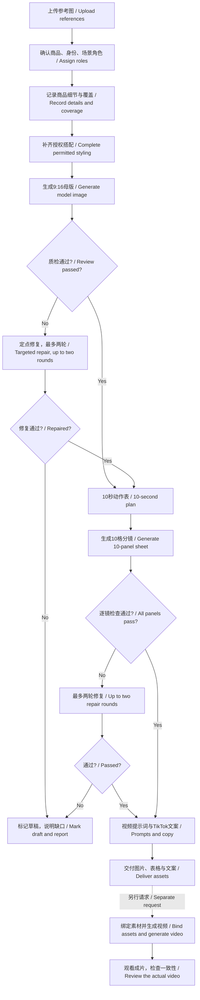

# 流程图 / Workflow

[返回首页 / Home](../README.md)

“通过”指检查中未发现明显偏差，不代表机器保证完全相同。重试上限是本教程的工作流约定；若仍失败，不把错图当成新商品事实。  
“Passed” means no obvious mismatch was found in review—not a guarantee of exact reproduction. The retry limit is this workflow’s convention; failed generations never redefine the product.

十镜头是十个画面时段，不要求每秒做复杂动作。细节镜头可用同一镜前素材的裁切，避免引入不合理的第三人机位。  
Ten shots are ten visual beats, not ten complex moves. Detail views can be crops of the same mirror view rather than an implausible second camera.
